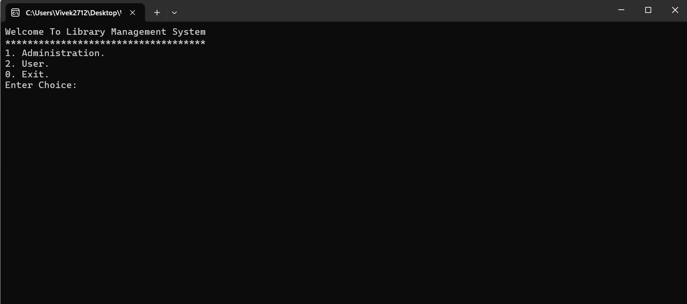
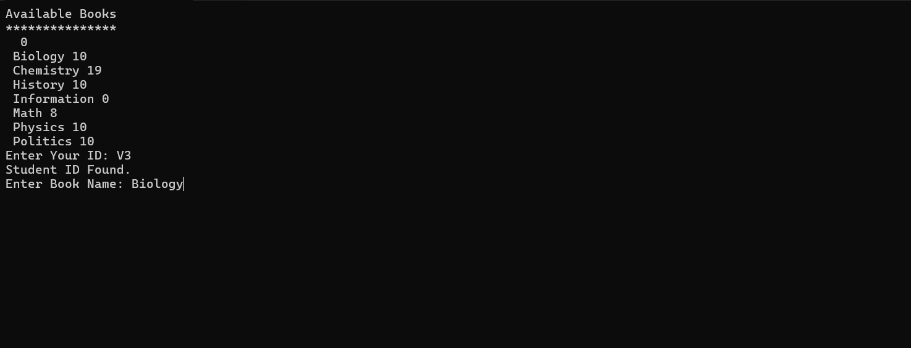

# 📚 Library Management System (C++ + MySQL)

A simple yet functional **Library Management System** built using **C++**, **MySQL**, and **OOPs concepts**. This console-based application allows admins to manage books and students, while users (students) can borrow books if available.

---

## 🔧 Features

- 📖 **Admin Panel**
  - Add new books with quantity
  - Register student IDs
  
- 👨‍🎓 **Student Panel**
  - Borrow books by entering their Student ID
  - View available books

- 🗂 **Database Integration**
  - All data stored and retrieved from **MySQL database**

- 🎯 **Clean OOP structure**
  - Use of C++ classes, encapsulation, and modular structure

---

## ⚙️ Tech Stack

- **Language:** C++
- **Database:** MySQL
- **Libraries Used:** MySQL Connector/C++
- **Platform:** Windows (uses `<windows.h>` and `Sleep()`)

---

## 🚀 Getting Started

### 📌 Prerequisites

- MySQL Server & Workbench installed and running
- MySQL Connector/C installed
- A database named `cpp` with the following tables:

```sql
CREATE DATABASE cpp;
USE cpp;

CREATE TABLE lib (
    Name VARCHAR(100),
    Quantity INT
);

CREATE TABLE student (
    Id VARCHAR(20)
);


## 🖼 Screenshots

Below are some screenshots of the application in action:

| Home Menu | Add Book | Borrow Book |
|-----------|----------|-------------|
|  |  |  |

| Student ID Not Found | Book Not Available | Book Borrowed Successfully |
|----------------------|--------------------|-----------------------------|
|  |  |  |

> 🖼 All screenshots are stored in the `screenshots/` folder. Images are named as `1.png`, `2.png`, ..., `6.png` and so on.
